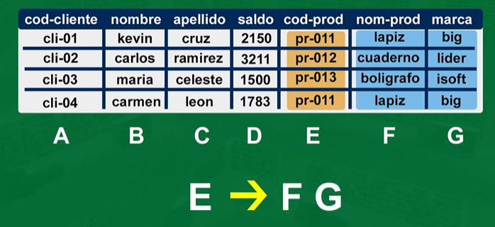

# Fundamental concepts

A **table** is a collection of related data entries and it consists of columns and rows.

A **row, tuple or record** represents a single, implicitly structured data item in a table.

A **column, attribute or field** is a single piece of data that is to be stored with each record.

In a database, the first row of a table always contains the attributes titles.

In contrast, the subsequent rows contain the records.

Then, there are other two concepts associated to the size of the table:
1. **Cardinality**: it refers to the number of rows in a table.
2. **Degree**: it refers to the number of columns in a table.

# Entity-Relationship Diagrams (ERD)

For this type of diagrams, we use the following symbols:

The simplest example of an entity and its attributes is the following:

## Primary key

The primary key is a column that uniquely identifies each row (record) in the table.
The selection of a primary key is a critical design decision for the database designer.
The rules to follow when choosing a primary key are:

1. It can't contain unknown (null) values.
2. It must be unique and not be repeated in time.

Let's use first example to illustrate this concept:

> The attributes of our entity (a tourist) are: phone, first name, last name and address.
> All of them are candidates to be the primary key, but none of them satisfies the 2nd rule: they aren't unique.
> Then, we need to create a new attribute that will be the primary key. In this case, we'll use the identity number.
> In a table, the first column is always the primary key.

# Entity-Relationship Model

Let's review two other concepts:

- **multivalued attribute**: it's an attribute that can have more than one value.
- **composite attribute**: it's an attribute that can be divided into smaller sub-parts.

Again, returning to our example:

> A multi-valued attribute could be the language, whereas a composite attribute could be the address (street, city, country, etc.).
> So, we have the following behaviors:

- In a table, composite attributes become fields.

- Multi-valued attributes become separate tables.

## Cardinality

It's the number of entities with which another entity can be associated through a relationship.
To show cardinalities, it's common to place tags in the lines that connect the relationships with the entities.
Its symbol is:

Now, there are types of cardinalities:
- **one-to-one (1:1)**: it's when each entity of a first set (relationship) is associated with only one entity of a second set (relationship).

- **one-to-many (1:N):** it's when each entity of a first set (R1) can be associated with many entities of a second set (R2), but each entity of the second set (R2) can be associated with only one entity of the first set (R1).

- **many-to-one (N:1)**: it's when each entity of a second set (R2) can be associated with many entities of a first set (R1), but each entity of the first set (R1) can be associated with only one entity of the second set (R2).

- **many-to-many (N:N)**: it's when each entity of a first set (R1) can be associated with many entities of a second set (R2) and vice versa.

Example:

> Let's consider the phrase "The director ... has shot the movie ..."
> From this phrase, we can identify the following:
> - A first set (R1): the director.
> - A second set (R2): the movie.
> - A relationship: the shooting of the film.
> Then, we can say that the cardinality is many-to-many (M:N). 
>

Another example would be:

# Exercise 1 of Database Design.

> "Given a department code, we want to know it name, its manager and the name, category and task of each employee."
>

1. **Identify what could be used as design tables.**
    - In this case, we'll take the following:
        - Department
        - Employee

2. **Identify the attributes of each table.**
    - Department:
        - Code
        - Name
        - Manager
    - Employee:
        - Name
        - Category
        - Task

3. **Identify or come up with a word that describes the relationship between the tables, and to determine the cardinality of the relationship.**
    - In this case, we could use:
        - Belongs

And we can say that the cardinality is one-to-many (1:N), because each department can have many employees, but each employee can belong to only one department.

4. **The fourth step is to identify if there are any special attributes with different behavior.**
    - But in this case we'll skip them.
5. **The 5th step is to identify or create a primary key for each table.**
    - In this case, we could use:
        - Department:
            - Code
        - Employee:
            - Name (assuming that each employee has a unique name)

# Exercise 2 of Database Design.

> "Given a professor code, determine its name, charge and category, aswell as the set of subjects that he/she teaches, with the code, name, hours and school in which they are taught."
>

Following steps described above, we have:
1. **Tables:**
    - Professor
    - Subjects

2. **Attributes:**
    - Professor:
        - Code
        - Name
        - Charge
        - Category
    - Subjects:
        - Code
        - Name
        - School

3. **Relationship:**
    - Teaches

And we can say that the cardinality is M:N, because each professor can teach many subjects, but each subject can be taught by many professors.
4. **Special attributes:**
    - Hours

And we place it connected to the relationship (Teaches). Also notice how it affects the cardinality.

5. **Primary keys:**
    - Professor:
        - Code
    - Subjects:
        - Code

# Exercise 3 of Database Design.

> "Professors decide to create a database with info of the students' results in the tests.
> For the design, it is known that:
>
> - Students are identified by their matriculation number, name and group.
> - Students take two type of tests:
>     - Theoretical tests: identified by their number, number of questions and date. It's wanted to know the students notes for each test and the completion date (all students take a same test in the same date).
>     - Practical tests: they are identified by their code, title and difficulty degree. A undetermined number of them are done, some by groups and others individually and in different dates. It's wanted to know the students notes for each test and date of the test.
> - In respect to the professors, aside from their code and name, it is wanted to know who designed each practical test and the correspondent date. A test can be designed by many professors and a professor can design many tests."
>

1. **Tables:**
    - Students
    - Theoretical tests
    - Practical tests
    - Professors

2. **Attributes (and primary keys):**
    - Students:
        - Matriculation number  (primary key)
        - Name
        - Group
    - Theoretical tests:
        - Number                (primary key)
        - Number of questions
        - Date
    - Practical tests:
        - Code                  (primary key)
        - Title
        - Difficulty degree
    - Professors:
        - Code                  (primary key)
        - Name

3. **Relationships:**
There are three relationships:
- Between Students and Theoretical tests: 'Take'; cardinality: M:N
- Between Students and Practical tests: 'Take'; cardinality: M:N
- Between Professors and Practical tests: 'Design'; cardinality: M:N

> Note:
> Something that hadn't been mentioned is that a good strategy to find or create the relationships is to:
> 
> 1. look for verbs in the description of the problem.
> 
> 2. look for a word that works as a bridge between two tables, both in active and passive voice. > For example:
>     - Students take tests./ Tests are taken by students.
>     - Professors design tests./ Tests are designed by professors.

4. **Special attributes:**
   - In Students and Theoretical tests:
        - Notes
    - In Students and Practical tests:
        - Notes
        - Date of the test
    - In Professors and Practical tests:
        - Date of the test

> Note:
> Other thing that hadn't been mentioned that is a good strategy is that:
> It can be thought of the special attributes as those who aren't inherent to a table, they don't exist as a feature of a single table, but they come to life when two tables are connected through a relationship.
> For example:
>
> - In Students and Theoretical tests:
>     - A student has a note in a theoretical test, but the note doesn't exist without the student and the test. A student doesn't have a note by itself, just for being a student.
> - In Students and Practical tests:
>     - A student has a date of completion of the test, but the date doesn't exist without the student and the test. A test can't have a completion date without a student.

5. **Table making.**
Our tables would look like this:

Note that the 'student-theoretical test', 'student-practical test' and 'professor-practical test' tables have two primary keys.

# Exercise 1 of Table Making - 1:N cardinality

Now let's consider this example, in which there's a **1:N cardinality**:

In this cases, the table of the entity with the 1 cardinality will have a primary key, and the table of the entity with the N (many) cardinality will have a 'foreign' key.

## Foreign key

A foreign key is a column or group of columns in a relational database table that provides a link between data in two tables.
Namely, the foreign key is a primary key from another table.
In this example, the table of "ad" will have its own primary key and the "client's" primary key as a foreign key.

# Normalization

Normalization is the process of organizing data in a database by applying a set of rules.
It is used to fix:

- **Insertion anomalies**: it's when we can't insert data into the database due to the absence of other data. Example:

- **Redundancy**: it's when we have repeated data. Example:

- **Deletion anomalies**: it's when we delete data and we lose other data. Example:

In round 90% of cases, 1st-2nd-3rd normal forms are enough to give solution to the problems mentioned above.
If we want to go further, we can use the Boyce-Codd normal form (BCNF) and the 4th-5th normal forms.

# First normal form (1NF)

For a table to be in the 1NF, it must meet the following requirements:
1. **It must only have atomic values (it can't have multi-valued attributes/ there can't be more than one value for an attribute in a tuple).**
2. **It must not have duplicated records (rows).**
	A rule of 1NF is that:
	- Repeated columns/fields must be removed and be placed in separate tables.

Let's see an example:

> This table has non atomic values, because there exists different values for 'subject'
>

And that is because there are duplicated groups.

So, the strategy is:
1. **Separate the attributes in this way:**

2. **Add primary keys to the new tables:**

3. **Create a new table with the primary keys of the other tables:**

This result is in 1NF, because:
- It has atomic values.
- It doesn't have duplicated records.

# Second normal form (2NF)

For a table to be in the 2NF, it must meet the following requirements:
- **It must be in the 1NF (prerequisite).**
- **It must not have partial dependencies.**

## Partial dependency and candidate keys

A **partial dependency** is when a non-key attribute is functionally dependent on part of a candidate key.
A **candidate key** is a column, or set of columns, in a table that uniquely identifies each row in a table.

In other words, a table is in 2NF if all non-key attributes are fully dependent on any candidate key.

Let's see an example:

> This is a table in 1NF. It has dependent elements (columns that depend on other columns).
> 1. 'product' and 'price' depend on 'code' (the primary key).
> 2. But, 'brand' depends on 'drawer' (not a primary key) aswell (assuming that each drawer has only one brand).
> 3. And, also, 'quantity' and 'total' depend on both 'code' and 'drawer'. This is because 'code' implicitly refers to a product and its price, and 'drawer' implicitly refers to a brand; and all of them are needed to calculate the quantity and the total.
>

Since we found 3 partial dependencies, we need to separate the table in 3 tables:
1. For the 'code -> product, price' dependency:

2. For the 'drawer -> brand' dependency:

3. For the 'code, drawer -> quantity, total' dependency:

Now, we analyze the new tables looking for duplicated records and remove them:

# Third normal form (3NF)

For a table to be in the 3NF, it must meet the following requirements:
- **It must be in the 2NF (prerequisite).**

- **It must not have transitive dependencies.**

## Transitive dependencies

A transitive dependency is when a non-key attribute is functionally dependent on another non-key attribute.

In other words, we need to remove all non-key attributes (columns) that depend on other non-key attributes (columns).
For this, we'll determine which are the columns that depend solely on other non-key attributes, and make a second table with those columns and the columns on which they depend.

An illustration of this is the following:
'T' will represent a table with the attributes A, B, C, D, E:

We'll assume A and B are the primary keys.
So we'll establish the following dependencies:
A B -> C (this is a dependency we need to keep, because C depends on A and B, which are primary keys)
C -> D E (transitive dependency: this is a dependency we need to remove, because D and E depend on C, which is not a primary key)

Thus, we'll create two tables:
Table B = (C, D, E)
Table A = (A, B, C)

Now, let's see an example:

> We have this table in 2NF:
>

And we find a first dependency:
A -> B C D E

However, this is ok because A is a primary key.
Then, we find a second dependency:
E -> F G

But this is not ok, because E is not a primary key and therefore, this is a transitive dependency.
So, we'll divide the table in two tables:

And with this, we've completed the 3rd normal form.